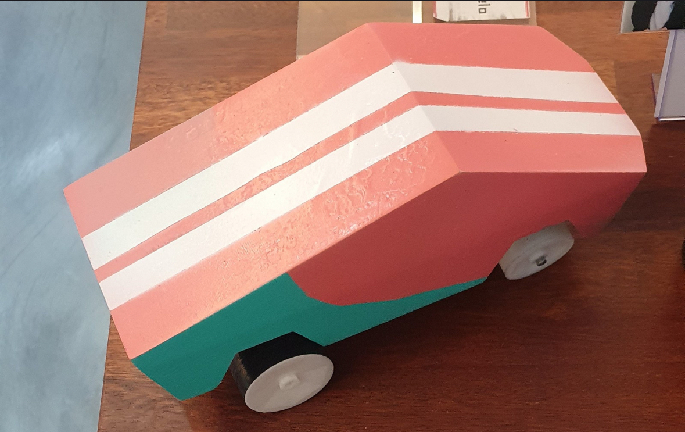
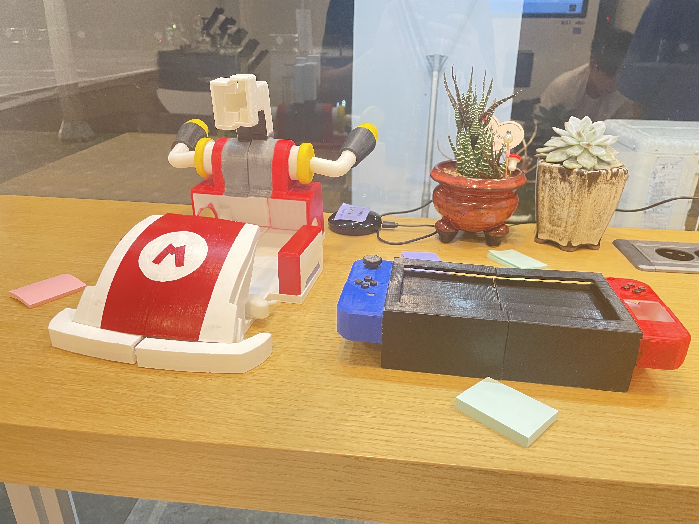
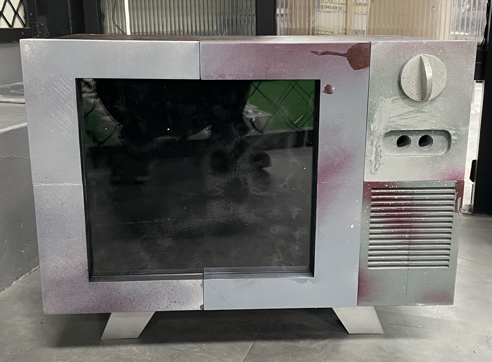

# 🎉 MIST Competition Projects: Arduino Creations 🤖

Welcome to the **MIST Competition Projects** repository! 🎊 This is where creativity meets technology 🚀. Here, you'll find three unique Arduino-based projects that showcase innovation, design, and technical skills 💻. Each project has its own charm, from futuristic vehicles 🚗 to spooky gadgets 🕷️. Let's dive in! 🔍

---

## 🌟 Projects Overview

### 1. 🚚 Cyber Truck (RC Car with Bluetooth Control) 📱

- **Description**: A sleek, futuristic RC car inspired by Tesla's Cyber Truck 🚀. This vehicle is controlled via a custom app built using MIT App Inventor, connecting seamlessly via Bluetooth 📲.
- **Features**:
  - **Bluetooth Control**: Drive the truck using your smartphone 📱.
  - **Responsive Steering**: Smooth and precise handling for tight turns 🔄.
  - **Customizable Speed**: Adjust speed settings directly from the app ⚙️.
- **How It Works**:
  - The Arduino board receives Bluetooth commands from the app and translates them into motor controls 🤖.
  - Two DC motors handle forward/backward motion and steering 🚗.
  - An ultrasonic sensor (optional) can be added for obstacle detection 🔍.
- **Technology Used**:
  - Arduino Uno 📈
  - MIT App Inventor 📊
  - HC-05 Bluetooth Module 📱
- **Future Improvements**:
  - Add autonomous driving mode using sensors 🤖.
  - Integrate voice commands for hands-free control 💬.

---

### 2. 🏎️ Mario Kart RC Car (Precision Driving) 🎮

- **Description**: A fun RC car inspired by the iconic Mario Kart game 🎮. This car features a custom-built controller for manual operation and precise controls for a smooth driving experience 🚗.
- **Features**:
  - **Custom Controller**: Built with potentiometers for steering and speed control 🎮.
  - **High Precision Driving**: Perfect for tight corners and competitive racing 🏎️.
  - **Boost Mode**: Press a button to activate a temporary speed boost! ⚡️
- **How It Works**:
  - The custom controller sends analog signals to the Arduino, which controls the motors accordingly 📈.
  - A servo motor handles steering, while a DC motor powers the wheels 🚗.
  - An LED indicator on the car lights up when "Boost Mode" is activated 💡.
- **Technology Used**:
  - Arduino Nano 📊
  - Custom-built hardware controller 🎮
  - Servo motor for steering 🔄
- **Future Improvements**:
  - Add sound effects from Mario Kart (e.g., "Wahoo!" when boosting) 🎵.
  - Implement multiplayer racing with multiple cars 🎮.

---

### 3. 📺 Horror TV (Spooky Toy) 👻

- **Description**: A creepy, old-fashioned TV model that surprises users with sudden movements and eerie sounds 🎃. Turn the dial to experience a chilling atmosphere as a hand slams against the screen! 😱
- **Features**:
  - **Interactive Dial Mechanism**: Turning the dial triggers random horror effects 🔄.
  - **Realistic Hand Movements**: A servo motor animates a hand that slams against the screen 👻.
  - **Sound Effects & Lights**: Creepy music, screams, and flickering LEDs enhance the spooky vibe 🎃.
- **How It Works**:
  - The dial is connected to a rotary encoder that sends signals to the Arduino 📈.
  - When certain positions are reached, a servo motor moves the hand inside the TV while sound effects play through a speaker module 🎵.
  - LEDs flicker in sync with the sounds for added effect 💡.
- **Technology Used**:
  - Arduino Uno 📈
  - Servo motor for hand movement 🔄
  - DFPlayer Mini MP3 module for sound effects 🎵
  - Rotary encoder for dial input 🔄
- **Future Improvements**:
  - Add more randomized effects to keep users guessing 🤔.
  - Include a hidden "safe mode" where nothing scary happens 😌.

---

## 🛠️ How to Build & Use

### 🚚 Cyber Truck
1. Assemble the RC car chassis with two DC motors and an Arduino board 🛠️.
2. Install the MIT App Inventor app on your Android device 📱.
3. Pair your phone with the HC-05 Bluetooth module on the car 📲.
4. Open the app, connect via Bluetooth, and start driving! 🚗

### 🏎️ Mario Kart RC Car
1. Build your RC car using an Arduino Nano, servo motor (for steering), and DC motor (for movement) 🛠️.
2. Assemble the custom controller using potentiometers or joysticks 🎮.
3. Connect everything as per the wiring diagram 📈.
4. Power it up and enjoy racing like Mario! Don’t forget to press "Boost"! ⚡️

### 📺 Horror TV
1. Assemble an old TV-style box with space for an Arduino board, servo motor, speaker module, and LEDs 📺.
2. Connect a rotary encoder to simulate an old-school TV dial mechanism 🔄.
3. Load sound effects onto an SD card and insert it into the DFPlayer Mini module 🎵.
4. Power it up, turn the dial… if you dare! 👻

---

## 🛠️ Technologies Used
- **Cyber Truck**: Arduino Uno, HC-05 Bluetooth Module, MIT App Inventor 📈
- **Mario Kart**: Arduino Nano, Servo Motor, Custom Controller 🎮
- **Horror TV**: Arduino Uno, Servo Motor, DFPlayer Mini MP3 Module 📺

---

## 🤝 Contributing

We’d love your contributions! If you have ideas or improvements for any of these projects:
1. Fork this repository 🍴
2. Create a new branch (`git checkout -b feature/amazing-feature`)
3. Commit your changes (`git commit -m 'Add amazing feature'`)
4. Push to your branch (`git push origin feature/amazing-feature`)
5. Open a Pull Request 🚀

---

## 💌 Contact Us

Have questions or want to collaborate? Reach out!
- Email: [hyun0810d@gmail.com](mailto:hyun0810d@gmail.com)
- GitHub Issues: Open an issue in this repository 📝

---

Thank you for checking out our projects! We hope you enjoy building them as much as we did creating them! 🎨✨  
Let’s make something amazing together! 💡  
